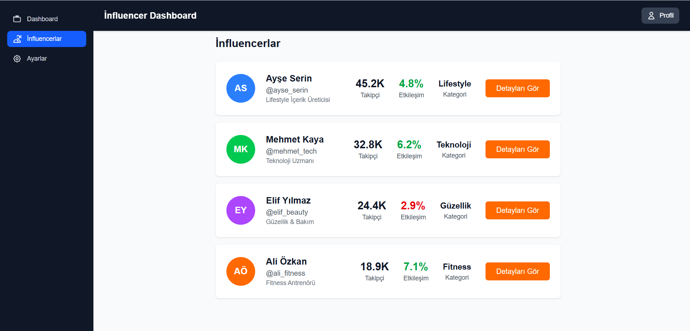
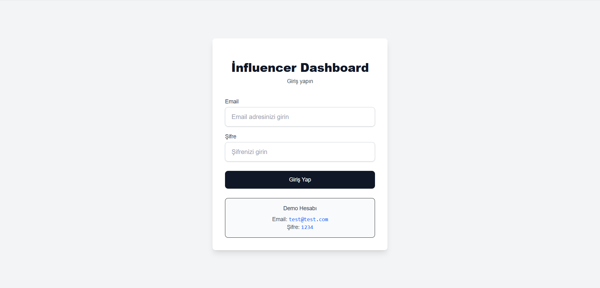
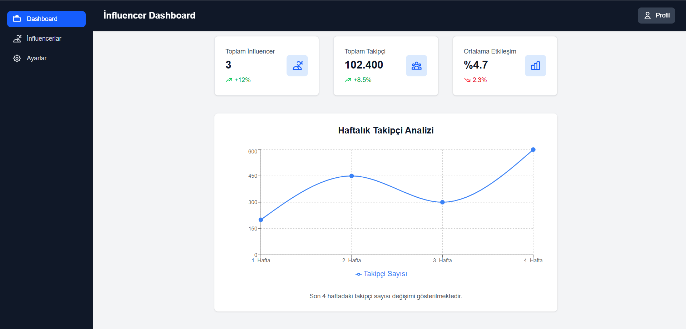

# Influencer Dashboard

A dashboard application developed to monitor influencer performance metrics.

## Screenshots







## Features

- Login system
- Dashboard page
- Influencer list
- Followers chart

## Technology Stack

- **Framework**: Next.js with TypeScript
- **Styling**: TailwindCSS
- **Charts**: Recharts

## Installation

```bash
npm install
npm run dev
```

Open [http://localhost:3000] in your browser.


## Login Credentials

- **Email**: test@test.com
- **Password**: 1234
